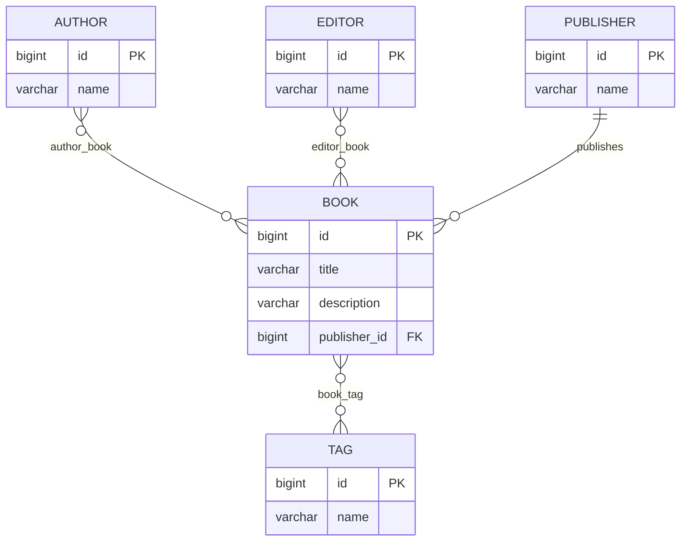

# Database schema

The schema is owned by Flyway (`src/main/resources/db/migration`); Hibernate runs
with `ddl-auto: validate` and only checks its entity mappings against it. This
document describes the schema as of migration **V6**.

## Domain model

A **book** is the centre of the model. Around it are four related concepts, and
the distinction between the last two matters (they are separate words in German):

| Entity      | German      | Is a…        | Relationship to book |
|-------------|-------------|--------------|----------------------|
| `Author`    | Autor       | person       | many-to-many         |
| `Editor`    | Herausgeber | person       | many-to-many         |
| `Publisher` | Verlag      | organization | many-to-one          |
| `Tag`       | —           | label        | many-to-many         |

`Author` and `Editor` are different roles a *person* plays; `Publisher` is the
*company* that publishes the book. A book has many authors and many editors, but
at most one publisher.

## Entity–relationship diagram

## Tables

All primary keys are `bigint generated by default as identity`.

### `book`
| Column         | Type            | Notes                                        |
|----------------|-----------------|----------------------------------------------|
| `id`           | bigint          | PK                                           |
| `title`        | varchar(255)    | not null                                     |
| `description`  | varchar(2000)   | nullable                                     |
| `publisher_id` | bigint          | FK → `publisher(id)`, `ON DELETE SET NULL`, indexed |

### `author`, `editor`, `publisher`, `tag`
Each is `(id bigint PK, name varchar(255) not null)`. Only **`tag.name`** carries
a `UNIQUE` constraint (see [Uniqueness policy](#uniqueness-policy)).

### Join tables (many-to-many)
Each has a composite primary key on both FK columns plus a secondary index on the
trailing column (so reverse lookups and cascade checks are indexed), and both FKs
are `ON DELETE CASCADE`.

| Table         | Columns                | Extra index            |
|---------------|------------------------|------------------------|
| `author_book` | `(author_id, book_id)` | `idx_author_book_book` |
| `editor_book` | `(editor_id, book_id)` | `idx_editor_book_book` |
| `book_tag`    | `(book_id, tag_id)`    | `idx_book_tag_tag`     |

## Referential integrity

- **Join-table FKs use `ON DELETE CASCADE`.** Deleting a book, author, editor, or
  tag automatically removes its link rows — no manual cleanup, no FK errors.
- **`book.publisher_id` uses `ON DELETE SET NULL`.** Deleting a publisher does not
  delete its books; they simply lose their publisher reference.

## Uniqueness policy

The guiding rule: **only enforce `UNIQUE` on values that are truly identifying.**

| Entity      | `name` unique? | Reason |
|-------------|----------------|--------|
| `Tag`       | ✅ yes         | A tag is a controlled label; its name *is* its identity. Two `java` tags would be meaningless. |
| `Author`    | ❌ no          | People's names collide — two different authors can share a name. |
| `Editor`    | ❌ no          | Same as author (a Herausgeber is a person). |
| `Publisher` | ❌ no          | A display name is not a natural key — distinct houses can share a name across jurisdictions or over time. A real key would be a registration number / ISBN prefix. |

Each of these decisions is pinned by an entity test (`*EntityTest`): the person
and publisher tests assert duplicate names are *allowed*; the tag test asserts a
duplicate is *rejected*.

## Migration history

| Version | Summary |
|---------|---------|
| `V1` | Initial `author`, `tag`, `book`, `book_tag`; `book` had a single `author_id`. |
| `V2` | Spring Modulith `event_publication` table. |
| `V3` | Author↔Book became many-to-many (`author_book`); added `Editor` + `editor_book`; dropped `book.author_id`. |
| `V4` | Join-table integrity: `ON DELETE CASCADE`, reverse indexes, and unique names on `tag`, `author`, `editor`. |
| `V5` | Added `Publisher` (Verlag) + `book.publisher_id`; dropped the incorrect person-name uniqueness on `author` and `editor`. |
| `V6` | Dropped `publisher.name` uniqueness (a display name is not a natural key). |

See [querying-the-database.md](querying-the-database.md) for how to connect and
run queries against this schema, and
[service-and-web-layers.md](service-and-web-layers.md) for how these ownership
and uniqueness decisions shape the services and the REST API.
