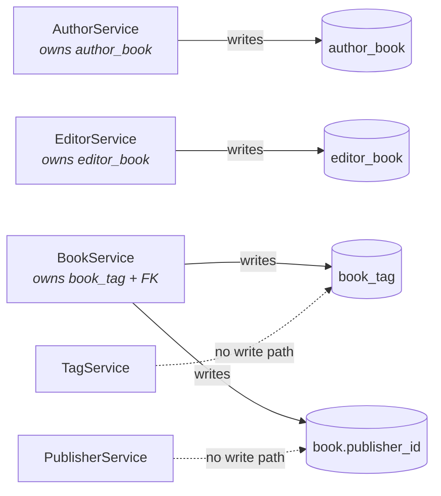

# Service and web layers

The schema decides where a write is allowed to go. This document records that
rule and the service and REST shapes that follow from it, as of migration
**V6**.

For how entities become views and views become DTOs, see
[mapping-with-mapstruct.md](mapping-with-mapstruct.md). For the tables and
constraints themselves, see [schema.md](schema.md).

## The rule: the owning side owns the operation

In a bidirectional JPA relation only **one** side is written to the database.
Hibernate reads the owning side at flush time and ignores the other. A write to
the inverse side is not an error — it is silently discarded, which is worse.

```java
// Silently does nothing. book_tag is owned by Book, not Tag.
tag.getBooks().add(book);
```

So each relation is managed by the service for the entity that owns it, and each
endpoint hangs off that entity's resource. The relation, not the noun that reads
best in a URL, decides where the operation lives.



## Who owns what

| Relation            | Owning side | Field carrying the mapping   | Service                          | Endpoint                                          |
|---------------------|-------------|------------------------------|----------------------------------|---------------------------------------------------|
| `author_book`       | `Author`    | `Author.books` `@JoinTable`  | `AuthorService.addBook/removeBook` | `PUT`/`DELETE /api/authors/{id}/books/{bookId}`   |
| `editor_book`       | `Editor`    | `Editor.books` `@JoinTable`  | `EditorService.addBook/removeBook` | `PUT`/`DELETE /api/editors/{id}/books/{bookId}`   |
| `book_tag`          | `Book`      | `Book.tags` `@JoinTable`     | `BookService.addTag/removeTag`   | `PUT`/`DELETE /api/books/{id}/tags/{tagId}`       |
| `book.publisher_id` | `Book`      | `Book.publisher` `@JoinColumn` | `BookService.setPublisher`     | `PUT /api/books/{id}/publisher/{publisherId}`     |

The inverse sides — `Book.authors`, `Book.editors`, `Tag.books`,
`Publisher.books` — are all `mappedBy` and are **read-only projections**. That
is why:

- `TagService` has no `addBook`. You tag a book at `/api/books/{id}/tags/{tagId}`.
- `PublisherService` has no `addBook`. You assign a publisher at
  `/api/books/{id}/publisher/{publisherId}`.
- Attaching an author is a `PUT` on `/api/authors`, not on `/api/books`, even
  though "add an author to a book" is the sentence you would say out loud.

### Both sides are still updated in memory

The owning-side write is what reaches the database, but Hibernate does not
maintain the other side of the object graph for you. Leaving it stale means the
rest of the transaction — including the mapper that is about to build the view —
sees the old picture. So the services update both:

```java
author.getBooks().add(book);   // this is the write that counts
book.getAuthors().add(author); // this only keeps the in-memory graph honest
```

## Services

One service per view, each returning views rather than entities.

| Service            | Reads                                | Writes                                          |
|--------------------|--------------------------------------|-------------------------------------------------|
| `AuthorService`    | `findAll`, `findById`                | `create`, `addBook`, `removeBook`, `delete`     |
| `EditorService`    | `findAll`, `findById`                | `create`, `addBook`, `removeBook`, `delete`     |
| `BookService`      | `findAll`, `findById`                | `create`, `update`, `setPublisher`, `addTag`, `removeTag`, `delete` |
| `TagService`       | `findAll`, `findById`, `findByName`  | `findOrCreate`, `delete`                        |
| `PublisherService` | `findAll`, `findById`, `findByName`  | `create`, `rename`, `delete`                    |

Three rules hold across all of them:

1. **Everything is transactional**, `readOnly = true` for the queries. The
   mapper walks lazy collections, so it must run inside the transaction — see
   the JPA trap section of the mapping guide.
2. **The controller never sees an entity.** It receives a finished view and hands
   it to `DtoMapper`. No repository, no `EntityManager`, no transaction.
3. **A missing id throws `EntityNotFoundException`**, which
   `ApiExceptionHandler` turns into a 404. Without it a missing row would
   surface as a 500, which is a lie: the request was fine.

### Name lookups follow the uniqueness policy

`TagService.findByName` returns an `Optional`; `PublisherService.findByName`
returns a `List`. That is not an inconsistency — `tag.name` is unique (`V4`) and
`publisher.name` deliberately is not (`V6`). The same split shows in the API:
`GET /api/tags?name=` answers with an object, `GET /api/publishers?name=` with
an array.

`TagService.findOrCreate` exists for the same reason. With a unique constraint, a
plain insert is a race against concurrent callers, so `POST /api/tags` is
idempotent: it returns the existing tag rather than failing.

## Deleting, and who does the cleanup

Three different mechanisms, depending on which side of the relation you are on.

| Deleting a…            | What clears the link rows                                    |
|------------------------|--------------------------------------------------------------|
| `Author` / `Editor`    | Hibernate — the collection is owned, so it deletes the rows.  |
| `Tag`                  | The database. Tag is the inverse side, so Hibernate does nothing; `ON DELETE CASCADE` on `book_tag` (`V4`) does it. |
| `Book`                 | Both. Book owns `book_tag`; `author_book` and `editor_book` go by database cascade. |
| `Publisher`            | Nobody deletes anything. `ON DELETE SET NULL` (`V5`) leaves the books in place without a publisher. |

The publisher case is why `BookView.publisher` is nullable and why the books
query uses a `LEFT JOIN`: a book without a publisher is a normal state, not an
error.

## REST surface

| Method   | Path                                        | Notes                                    |
|----------|---------------------------------------------|------------------------------------------|
| `GET`    | `/api/books`                                | 4 SQL queries regardless of book count   |
| `GET`    | `/api/books/{id}`                           | 404 if absent                            |
| `POST`   | `/api/books`                                | 201 + `Location`                         |
| `PUT`    | `/api/books/{id}`                           | title/description only                   |
| `PUT`    | `/api/books/{id}/publisher/{publisherId}`   |                                          |
| `DELETE` | `/api/books/{id}/publisher`                 | clears it; nullable column               |
| `PUT`    | `/api/books/{id}/tags/{tagId}`              |                                          |
| `DELETE` | `/api/books/{id}/tags/{tagId}`              |                                          |
| `DELETE` | `/api/books/{id}`                           | 204                                      |
| `GET`    | `/api/authors`, `/api/editors`              | also `/{id}`                             |
| `POST`   | `/api/authors`, `/api/editors`              | 201 + `Location`                         |
| `PUT`    | `/api/authors/{id}/books/{bookId}`          | and the `/editors` equivalent            |
| `DELETE` | `/api/authors/{id}/books/{bookId}`          | and the `/editors` equivalent            |
| `GET`    | `/api/tags`, `/api/tags/{id}`               |                                          |
| `GET`    | `/api/tags?name=`                           | single object — `tag.name` is unique     |
| `POST`   | `/api/tags`                                 | idempotent (`findOrCreate`)              |
| `GET`    | `/api/publishers`, `/api/publishers/{id}`   |                                          |
| `GET`    | `/api/publishers?name=`                     | **array** — names are not unique         |
| `PUT`    | `/api/publishers/{id}`                      | rename                                   |
| `DELETE` | `/api/{resource}/{id}`                      | 204 on every resource                    |

### Request validation

Request bodies are records with Jakarta Bean Validation constraints, applied via
`@Valid`. The limits mirror the columns rather than being chosen freely —
`varchar(255)` for names and titles, `varchar(2000)` for `book.description`:

```java
public record NameRequest(@NotBlank @Size(max = 255) String name) {}
```

Without the `@Size`, an over-long value reaches Postgres and returns a 500 from a
constraint violation. With it, the client gets a 400 naming the field:

```json
{ "status": 400,
  "detail": "Request body failed validation",
  "errors": { "name": "must not be blank" } }
```

`description` carries no `@NotBlank`, because its column is nullable.

### Status codes

| Code  | When                                                              |
|-------|-------------------------------------------------------------------|
| `200` | successful read or relation change (the updated view is returned) |
| `201` | resource created, with a `Location` header                        |
| `204` | deleted                                                           |
| `400` | request body failed validation, with per-field `errors`           |
| `404` | id did not resolve, via `EntityNotFoundException`                 |
